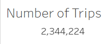
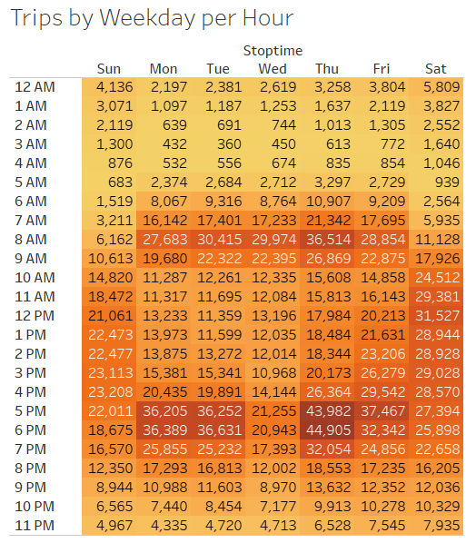
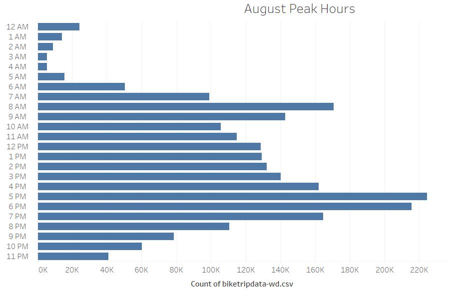
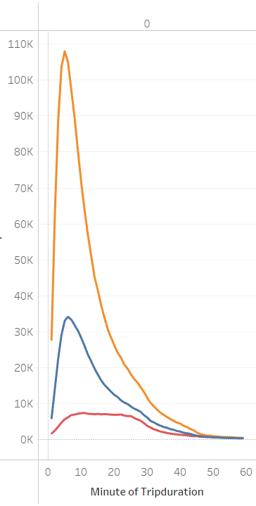
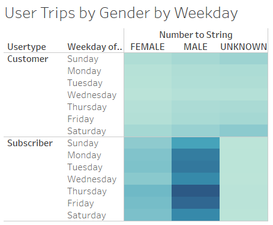
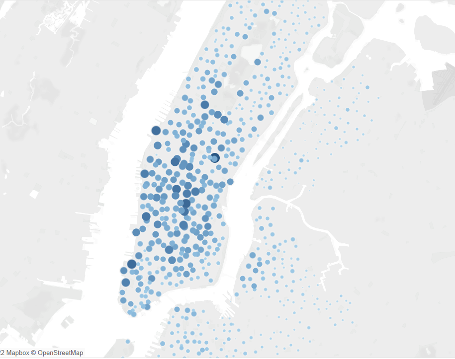
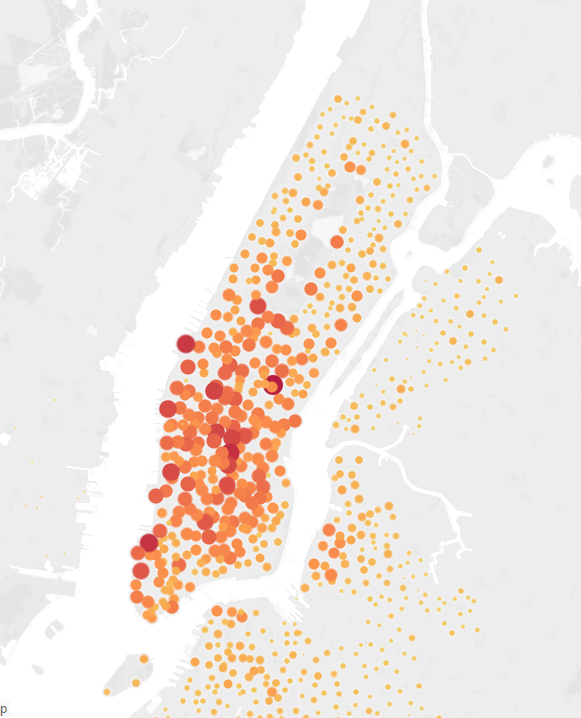

# NYC Citibike Analysis
## Overview: 

To analysis bike sharing data, create visualizations of your analysis and  use that data to convince investors that a bike-sharing program in Des Moines is a solid business proposal.

### Deliverables

- 1: Change Trip Duration to a Datetime Format
- 2: Create Visualizations for the Trip Analysis
- 3: Create a Story and Report for the Final Presentation

## Results: 

Using the visualizations in my Tableau Story, describe the results of each visualization underneath the image.

[link to Tableau story](https://public.tableau.com/authoring/NYCCitibikeAnalysis_16543800909920/Story1#1)

[link to Tableau dashboard](https://public.tableau.com/authoring/NYCCitibikeAnalysis_16543800909920/Dashboard1#1)

## Summary:

Based on the analysis of the bike sharing data from New York City in August of 2018, I would recommend investors support a business proposal to start up a program in Des Moines or another similar city.

**These results are based off over 2 million records of usage in one month**

**Services are being used 24 hours a day, 7 days a week.**

​	

**This graph shows peak hours but you can also see the best hours for bike maintenance **
**are 1am - 5am.**

**This chart shows us that men may checkout bikes at a higher frequency but women ride the same amount of time.**

**This heatmap shows that Subscribers of the sharing program ride more frequently than the average Customer but support across both categories is consistently present .**

**There are just as many popular starting locations being utilized as there are ending.**

